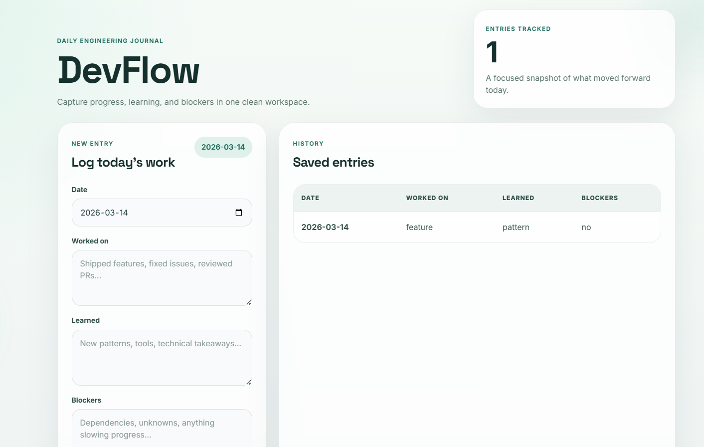
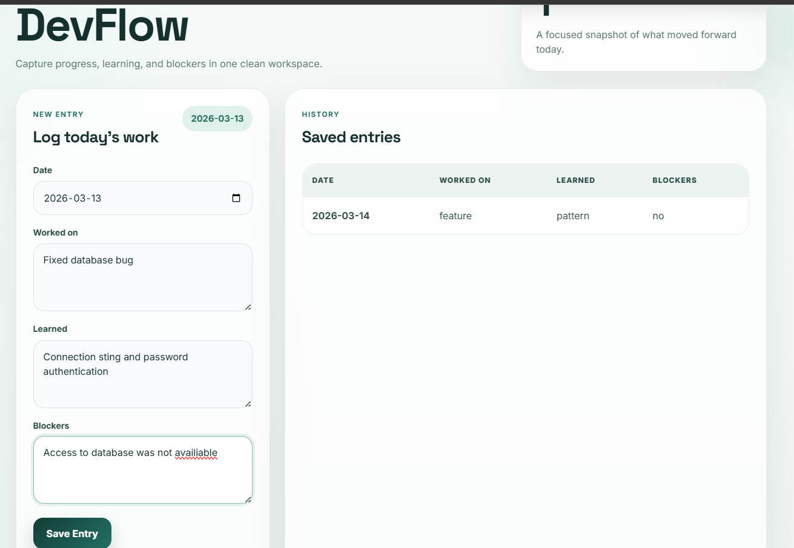
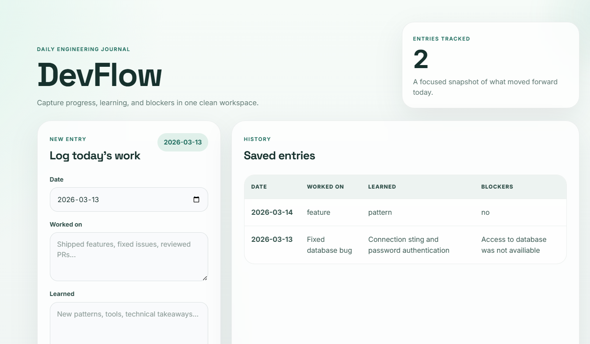

<!-- PROJECT HEADER -->
<br />

<p align="center">
  <h3 align="center">DevFlow</h3>

  <p align="center">
    A full-stack developer productivity platform built to help developers log daily work, track progress, and stay consistent.
    <br/>
    <br/>
    Log your work. Track your progress. Stay consistent.
    <br/>

    <a href="https://dev-flow-puce.vercel.app/">Check it out!</a>
    <br/>
    <a href="https://github.com/jabhandari/devflow">View Code</a>
    ·
    <a href="https://github.com/jabhandari/devflow/issues">Report Bug</a>
    ·
    <a href="https://github.com/jabhandari/devflow/issues">Request Feature</a>
  </p>
</p>
<p align="centre">
    **Frontend deployed on Vercel and backend deployed on Render.**
</p>

<p align="center">
  
  
  
  
  
  
</p>

---

<!-- TABLE OF CONTENTS -->

<details open="open">
  <summary><h2 style="display: inline-block">Table of Contents</h2></summary>
  <ol>
    <li>
      <a href="#about-the-project">About The Project</a>
      <ul>
        <li><a href="#built-with">Built With</a></li>
        <li><a href="#features">Features</a></li>
        <li><a href="#deployment">Deployment</a></li>
      </ul>
    </li>
    <li><a href="#project-structure">Project Structure</a></li>
    <li><a href="#getting-started">Getting Started</a>
      <ul>
        <li><a href="#prerequisites">Prerequisites</a></li>
        <li><a href="#installation">Installation</a></li>
        <li><a href="#running-the-project">Running the Project</a></li>
      </ul>
    </li>
    <li><a href="#environment-variables">Environment Variables</a></li>
    <li><a href="#api-endpoints">API Endpoints</a></li>
    <li><a href="#future-improvements">Future Improvements</a></li>
    <li><a href="#author">Author</a></li>
  </ol>
</details>

<br/>

<!-- ABOUT THE PROJECT -->

## About The Project

<p align="center">
  
</p>

DevFlow is a **developer productivity and progress tracking application** built using the **MERN stack**. It helps developers maintain a record of their daily work, monitor progress over time, and build consistency in their development workflow.

Instead of keeping scattered notes across different apps or losing track of completed work, DevFlow gives users a focused place to:

- Log daily development activity
- Review previous entries
- Track work history over time
- Build better documentation habits

This project demonstrates a modern full-stack architecture with a **React frontend**, **Express/Node.js backend**, and **MongoDB database integration**.

<br/>

## Built With

### Frontend
- [React](https://react.dev/)
- [Vite](https://vitejs.dev/)
- JavaScript
- CSS

### Backend
- [Node.js](https://nodejs.org/)
- [Express.js](https://expressjs.com/)
- [Mongoose](https://mongoosejs.com/)

### Database
- [MongoDB](https://www.mongodb.com/)

### Other Tools
- [Axios](https://axios-http.com/)
- [JWT](https://jwt.io/)
- [Nodemon](https://www.npmjs.com/package/nodemon)
- [dotenv](https://www.npmjs.com/package/dotenv)

<br/>

## Features

- #### Daily Development Logging

<p align="center">
  
</p>

Users can create daily development logs to document what they worked on and keep a record of their progress.

Key highlights:
- Add development entries
- Save logs to the database
- Keep daily work organized

---

- #### Saved Entries Dashboard

<p align="center">
  
</p>

Users can view previously saved entries through a clean dashboard interface.

Key highlights:
- Review past work
- Track development history
- Manage saved logs

---

- #### Full-Stack MERN Architecture

DevFlow is structured as a complete full-stack application with separate client and server layers.

Key highlights:
- REST API integration
- MongoDB data persistence
- Frontend and backend separation
- Scalable project structure

<br/>
## Deployment

DevFlow is deployed as a full-stack application using separate services for the frontend and backend:

- **Frontend:** deployed on **Vercel**
- **Backend:** deployed on **Render**

Live Application:  
[https://dev-flow-puce.vercel.app/](https://dev-flow-puce.vercel.app/)

<br/>

## Project Structure

```sh
devflow
│
├── client/                # React frontend
│   ├── src/
│   ├── public/
│   └── vite.config.js
│
├── server/                # Node + Express backend
│   ├── controllers/
│   ├── models/
│   ├── routes/
│   ├── middleware/
│   └── server.js
│
└── screenshots/           # README screenshots
```
## Getting Started

To get a local copy up and running, follow these simple steps.

---

### Prerequisites

Make sure you have the following installed:

- Node.js
- npm
- MongoDB (local or Atlas)

Download Node.js here:

https://nodejs.org/

---

------------------------------------------------------------------------

## Installation

Clone the repository

``` bash
git clone https://github.com/jabhandari/devflow.git
cd devflow
```

Install backend dependencies

``` bash
cd server
npm install
```

Install frontend dependencies

``` bash
cd ../client
npm install
```

------------------------------------------------------------------------

# Running the Project

Start the backend

``` bash
cd server
npm run dev
```

Start the frontend

``` bash
cd client
npm run dev
```

Open:

    http://localhost:5173

------------------------------------------------------------------------

# Environment Variables

Create a `.env` file inside **server**:

    MONGO_URI=your_mongodb_connection_string
    JWT_SECRET=your_secret_key
    PORT=5000

------------------------------------------------------------------------

# API Endpoints

## Authentication

Register user

    POST /api/auth/register

Login user

    POST /api/auth/login

------------------------------------------------------------------------

## Entries

Get all entries

    GET /api/entries

Create entry

    POST /api/entries

Delete entry

    DELETE /api/entries/:id

------------------------------------------------------------------------

# Future Improvements

Potential improvements:

-   Edit entries
-   Markdown support
-   Tagging system
-   Developer productivity analytics
-   CI/CD pipeline
-   Docker deployment

------------------------------------------------------------------------

# Author

**Juhi Bhandari**\
Software Developer\
Toronto, Canada

GitHub: https://github.com/jabhandari
