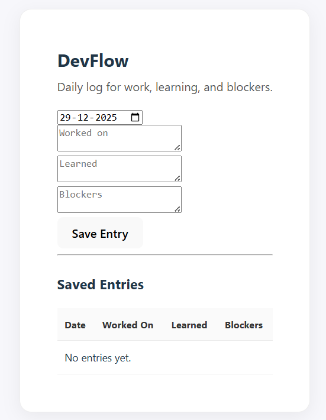
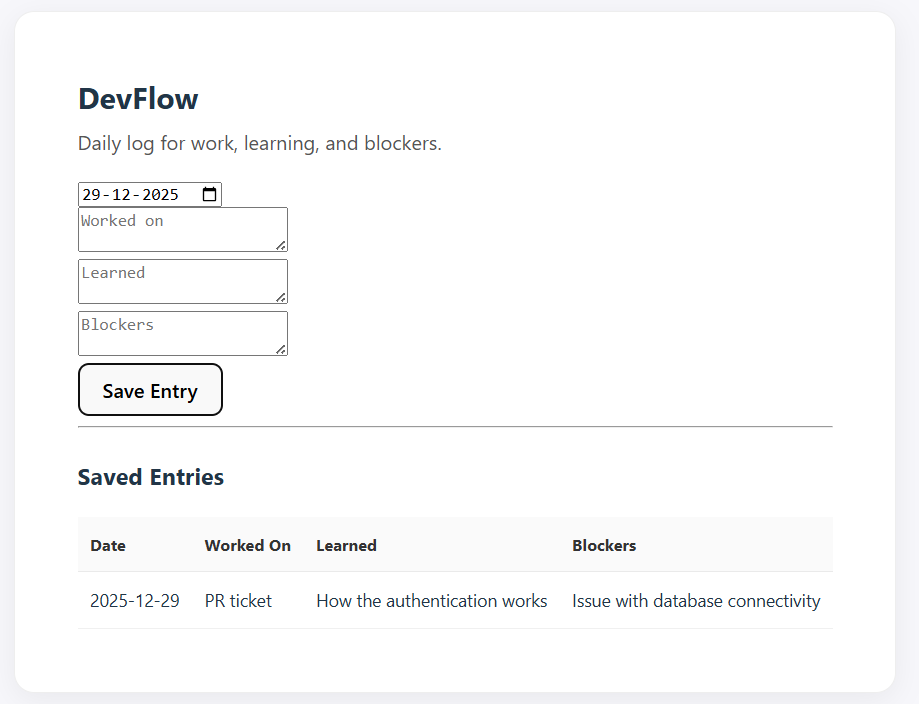

<br />
<p align="center">

<h3 align="center">DevFlow</h3>

<p align="center">
A developer productivity application to track daily progress and manage development logs.
<br/>
<br/>
Log your work. Track your progress. Stay consistent.
<br/>
<br/>
·
<a href="https://github.com/jabhandari/devflow/issues">Report Bug</a>
·
<a href="https://github.com/jabhandari/devflow/issues">Request Feature</a>

</p>
</p>

---

## About The Project

DevFlow is a **full-stack developer productivity application** built with the **MERN stack (MongoDB, Express, React, Node.js)**.

The platform allows developers to log daily development work, track progress entries, and manage development logs through a simple and responsive interface.

---

## Built With

Frontend  
- React  
- Vite  
- JavaScript  
- CSS  

Backend  
- Node.js  
- Express.js  
- Mongoose  

Database  
- MongoDB  

Other Tools  
- Axios  
- JSON Web Token (JWT)  
- Nodemon  

---

## Features

### Daily Development Log
Developers can log daily work and track progress.



---

### Saved Entries Dashboard
View and manage all previously saved entries.



---

## Getting Started

Follow these steps to run the project locally.

### Prerequisites

Make sure you have:

- Node.js
- npm
- MongoDB

Download Node.js from:  
https://nodejs.org/

---

### Installation

Clone the repository

```bash
git clone https://github.com/jabhandari/devflow.git
cd devflow
```

Install backend dependencies

```bash
cd server
npm install
```

Install frontend dependencies

```bash
cd client
npm install
```

---

### Running the Project

Start the backend server

```bash
cd server
npm run dev
```

Start the frontend

```bash
cd client
npm run dev
```

Open the application at

```
http://localhost:5173
```

---

## Environment Variables

Create a `.env` file inside the `server` folder:

```
MONGO_URI=your_mongodb_connection_string
JWT_SECRET=your_secret_key
PORT=5000
```

---

## API Endpoints

Authentication

- POST `/api/auth/register`
- POST `/api/auth/login`

Entries

- GET `/api/entries`
- POST `/api/entries`
- DELETE `/api/entries/:id`

---

## Author

**Juhi Bhandari**  
Software Developer  
Toronto, Canada